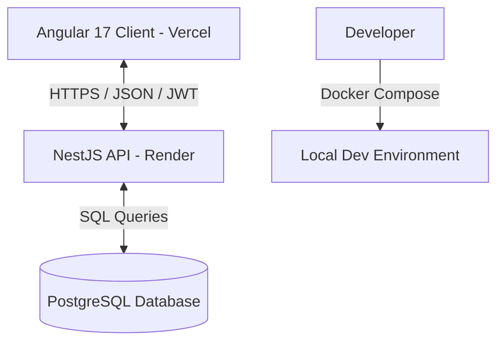

# Footloose - Sistema de Gestión de Zapatería (Frontend)

Este es el repositorio del frontend de **Footloose**, un sistema web moderno de gestión de inventario, usuarios y roles diseñado para tiendas de calzado.

El proyecto está construido con **Angular 17**, aprovechando tecnologías modernas como **Angular Signals** para el manejo del estado, **SSR (Server-Side Rendering)** y una arquitectura limpia orientada a componentes.

---

## 🔗 Enlaces del Proyecto

*   **Demo en Vivo (Frontend - Vercel):** [https://github.com/Bloddy20Moon/SistemaZapateriaFront](https://github.com/Bloddy20Moon/SistemaZapateriaFront) *(Configura aquí la URL final que te dé Vercel)*
*   **API Backend (Render):** [https://footloose-backend.onrender.com/](https://footloose-backend.onrender.com/)
*   **Repositorio del Backend:** [Bloddy20Moon/SistemaZapateriaBack](https://github.com/Bloddy20Moon/SistemaZapateriaBack)

---

## 🛠️ Arquitectura y Flujo de Datos

El sistema se basa en un desacoplamiento completo entre el Frontend y el Backend, comunicándose de manera segura mediante una API RESTful protegida por tokens JWT.



---

## ✨ Características Principales

*   **Autenticación y Autorización Completa:** Inicio de sesión protegido mediante tokens JWT almacenados de forma segura, con cierre de sesión y control automático de expiración de sesión.
*   **Control de Accesos Basado en Roles (RBAC):** Gestor interactivo de permisos donde los administradores pueden activar/desactivar el acceso de cada rol a módulos específicos de manera dinámica.
*   **Gestión Dinámica de Inventario (CRUDs):** Modulación completa para administrar **Marcas, Modelos, Colores, Tallas y Productos** finales, incluyendo carga de imágenes.
*   **Dashboard Estadístico:** Gráficas interactivas que proveen analíticas rápidas sobre el estado del inventario y las categorías del sistema.
*   **Reportería Avanzada:** 
    *   Generación y descarga de reportes de productos en formato **PDF** (`pdfmake`).
    *   Exportación e importación de listados de catálogos en formato **Excel** (`xlsx`).
*   **Protección de Rutas:** Guardias de Angular para evitar el ingreso no autorizado a vistas administrativas.

---

## 💻 Tecnologías Utilizadas

### Frontend
*   **Angular 17** (con soporte para SSR)
*   **Angular Signals** (manejo reactivo de estado de la aplicación)
*   **TypeScript**
*   **Angular Material** (componentes UI avanzados)
*   **Bootstrap 5** (estilos y layouts responsivos)
*   **RxJS** (programación reactiva y manejo de flujos asíncronos)
*   **Chart.js** (visualización de analíticas y gráficas)
*   **PDFMake** y **XLSX** (generación y exportación de documentos)

### Backend (Desplegado por separado)
*   **NestJS** + **TypeScript**
*   **TypeORM** (ORM para persistencia de datos)
*   **PostgreSQL** (base de datos relacional)
*   **Docker & Docker Compose** (contenedorización de servicios)

---

## 🚀 Instalación y Configuración Local

### Prerrequisitos
*   Node.js (versión 18 o superior recomendada)
*   Angular CLI instalado globalmente (`npm install -g @angular/cli`)

### Pasos
1. **Clonar el repositorio:**
   ```bash
   git clone https://github.com/Bloddy20Moon/SistemaZapateriaFront.git
   cd SistemaZapateriaFront
   ```

2. **Instalar dependencias:**
   ```bash
   npm install
   ```

3. **Configurar el Backend URL:**
   Abre el archivo [src/app/environments/environments.ts](src/app/environments/environments.ts) y edita la URL de tu API para desarrollo o producción:
   ```typescript
   export const environment = {
       production: false,
       BACKEND_URL: 'http://localhost:3000/api/v1/', // URL local del backend
   }
   ```

4. **Levantar el servidor de desarrollo:**
   ```bash
   npm run start
   ```
   Abre [http://localhost:4200](http://localhost:4200) en tu navegador para ver la aplicación ejecutándose.

5. **Compilar para producción:**
   ```bash
   npm run build
   ```
   Esto generará una carpeta `dist/footloose-frontend` lista para ser servida.
